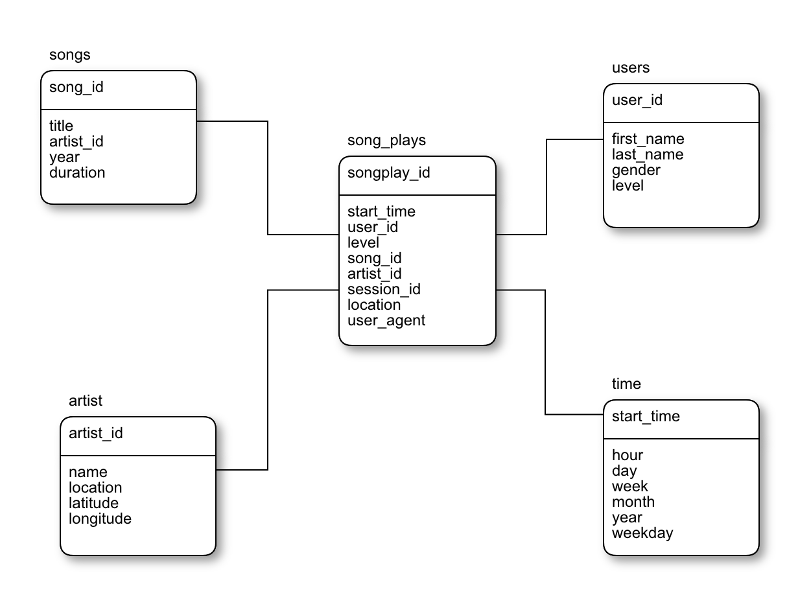

# Introduction
A music streaming startup, Sparkify, has grown their user base and song database and want to move their processes and data onto the cloud. Their data resides in S3, in a directory of JSON logs on user activity on the app, as well as a directory with JSON metadata on the songs in their app.  

As their data engineer, you are tasked with building an ETL pipeline that extracts their data from S3, stages them in Redshift, and transforms data into a set of dimensional tables for their analytics team to continue finding insights in what songs their users are listening to. 

# Project Description
In this project, you'll apply what you've learned on data warehouses and AWS to build an ETL pipeline for a database hosted on Redshift. To complete the project, you will need to load data from S3 to staging tables on Redshift and execute SQL statements that create the analytics tables from these staging tables.

## Project Datasets
You'll be working with two datasets that reside in S3. Here are the S3 links for each:

Song data:  
[s3://udacity-dend/song_data](s3://udacity-dend/song_data)

Log data:  
[s3://udacity-dend/log_data](s3://udacity-dend/log_data)

Log data json path:   
[s3://udacity-dend/log_json_path.json](s3://udacity-dend/log_json_path.json)

## Song Dataset
The first dataset is a subset of real data from the Million Song Dataset. Each file is in JSON format and contains metadata about a song and the artist of that song. The files are partitioned by the first three letters of each song's track ID. For example, here are filepaths to two files in this dataset.

> song_data/A/B/C/TRABCEI128F424C983.json
song_data/A/A/B/TRAABJL12903CDCF1A.json

## Log Dataset
The second dataset consists of log files in JSON format generated by this event simulator based on the songs in the dataset above. These simulate app activity logs from an imaginary music streaming app based on configuration settings.

The log files in the dataset you'll be working with are partitioned by year and month. For example, here are filepaths to two files in this dataset.

> log_data/2018/11/2018-11-12-events.json

# Project Instructions

## Schema for Song Play Analysis
Using the song and event datasets, you'll need to create a star schema optimized for queries on song play analysis. This includes the following tables.

### **Fact Table**

**songplays** - records in event data associated with song plays i.e. records with page NextSong
songplay_id, start_time, user_id, level, song_id, artist_id, session_id, location, user_agent

### **Dimension Tables**

**users** - users in the app user_id, first_name, last_name, gender, level

**songs** - songs in music database song_id, title, artist_id, year, duration

**artists** - artists in music database artist_id, name, location, lattitude, longitude

**time** - timestamps of records in songplays broken down into specific units start_time, hour, day, week, month, year, weekday

# Project Steps
Below are steps you can follow to complete each component of this project.

### Create Table Schemas
1. Design schemas for your fact and dimension tables
2. Write a SQL **CREATE** statement for each of these tables in **sql_queries.py**
3. Complete the logic in **create_tables.py** to connect to the database and create these tables
4. Write SQL **DROP** statements to drop tables in the beginning of **create_tables.py** if the tables already exist. This way, you can run create_tables.py whenever you want to reset your database and test your ETL pipeline.
5. Launch a redshift cluster and create an IAM role that has read access to S3.
6. Add redshift database and IAM role info to **dwh.cfg**.
7. Test by running **create_tables.py** and checking the table schemas in your redshift database. You can use Query Editor in the AWS Redshift console for this.


### Build ETL Pipeline
1. Implement the logic in **etl.py** to load data from S3 to staging tables on Redshift.
2. Implement the logic in **etl.py** to load data from staging tables to analytics tables on Redshift.
3. Test by running **etl.py** after running create_tables.py and running the analytic queries on your Redshift database to compare your results with the expected results.

# Tables

### 1. Schema


### 2. Queries and Results
```sql
SELECT count(*) FROM staging_events -- 8.056

SELECT count(*) FROM staging_songs -- 14.896

SELECT count(*) FROM users -- 96

SELECT count(*) FROM songs -- 14896

SELECT count(*) FROM artists -- 10.025

SELECT count(*) FROM songplays -- 1.144

SELECT count(*) FROM time -- 8.023
```